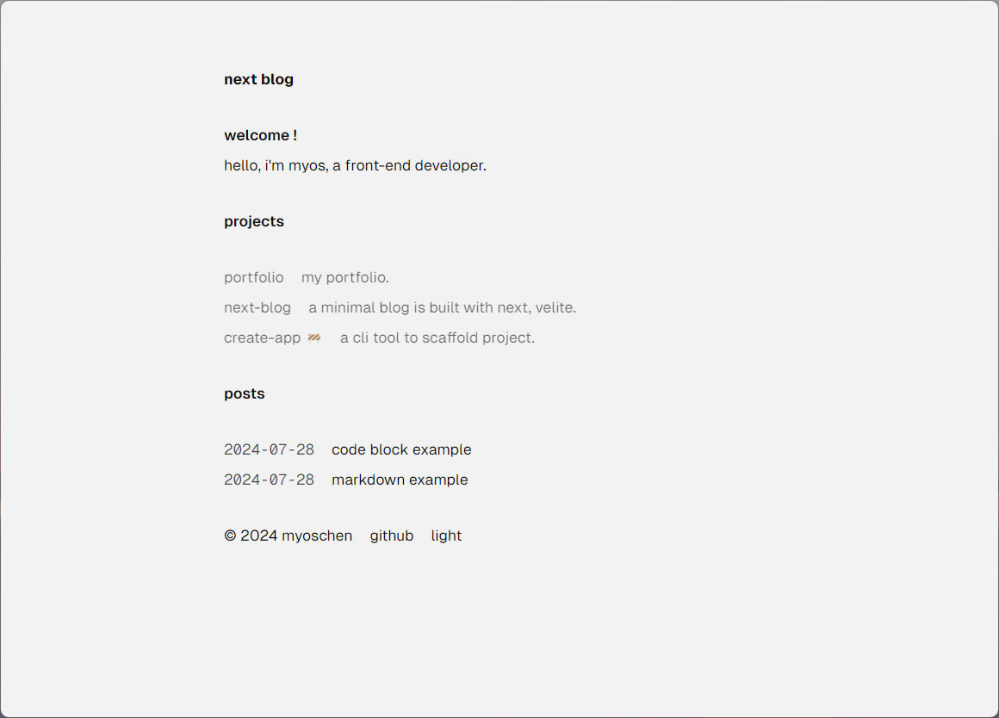
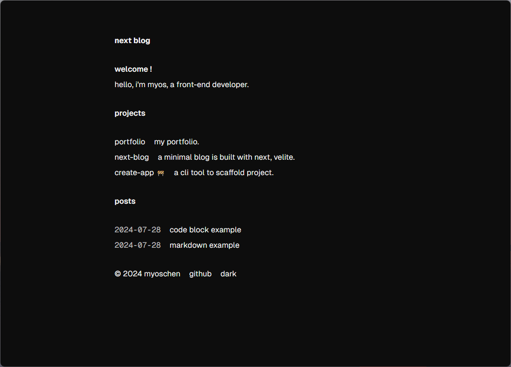

# next-blog

<!-- should be repaced with your username, repo name, branch -->


<!-- project description -->
Build a minimal blog with Next.js, Tailwind CSS and Velite.

## Screenshots

| Light Theme                          | Dark Theme                         |
| ------------------------------------ | ---------------------------------- |
|  |  |

## Usage

```bash
# clone the repository
git clone https://github.com/Myoschen/next-blog.git

# change directory
cd next-blog

# install deps
pnpm install

# start server
pnpm run dev

# open browser and visit http://localhost:3000
```

### Create posts

Create a new `Markdown` file in the `content/posts` directory to add a new post.

### Deploy

Simply place the following `deploy.yml` under the `.github/workflows` directory and push it to GitHub to automatically build and deploy via GitHub Actions.

```yml
name: Deploy Next.js site to Pages

on:
  push:
    branches: ["main"]

  workflow_dispatch:

permissions:
  contents: read
  pages: write
  id-token: write

concurrency:
  group: "pages"
  cancel-in-progress: false

jobs:
  build:
    runs-on: ubuntu-latest
    strategy:
      matrix:
        node-version: [20]
    steps:
      - name: Checkout
        uses: actions/checkout@v4

      - name: Install pnpm
        uses: pnpm/action-setup@v4
        with:
          version: 9

      - name: Setup Node
        uses: actions/setup-node@v4
        with:
          node-version: ${{ matrix.node-version }}
          cache: 'pnpm'

      - name: Setup Pages
        uses: actions/configure-pages@v4

      - name: Restore cache
        uses: actions/cache@v4
        with:
          path: |
            .next/cache
          key: ${{ runner.os }}-nextjs-${{ hashFiles('**/pnpm-lock.yaml') }}-${{ hashFiles('**.[jt]s', '**.[jt]sx') }}
          restore-keys: |
            ${{ runner.os }}-nextjs-${{ hashFiles('**/pnpm-lock.yaml') }}-

      - name: Install dependencies
        run: pnpm install

      - name: Build with Next.js
        run: pnpm run build

      - name: Upload artifact
        uses: actions/upload-pages-artifact@v3
        with:
          path: ./out

  deploy:
    environment:
      name: github-pages
      url: ${{ steps.deployment.outputs.page_url }}
    runs-on: ubuntu-latest
    needs: build
    steps:
      - name: Deploy to GitHub Pages
        id: deployment
        uses: actions/deploy-pages@v4
```

## License

Licensed under the [MIT License](./LICENSE).
